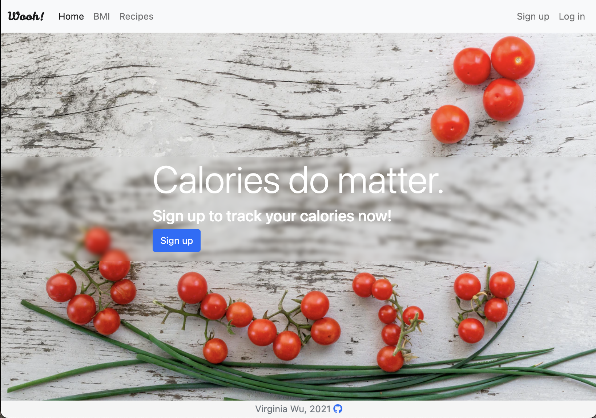
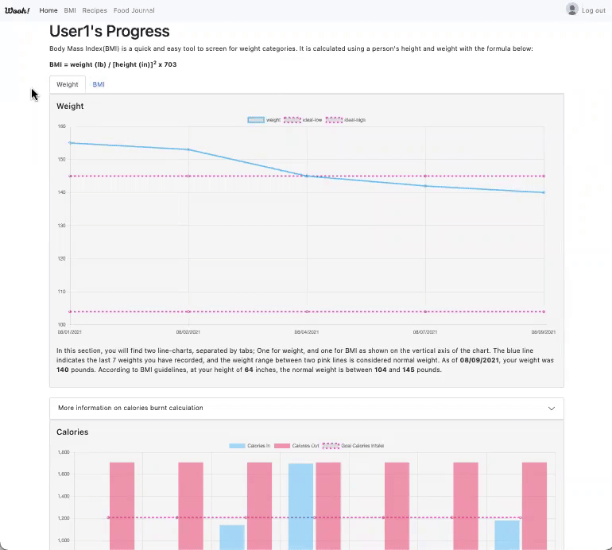

# Capstone1

[**Capstone Proposal**](https://docs.google.com/document/d/1prfd2nlzSNhN5D9v7eK900ymWZ2taY87FtZE1uVcpbw/edit?usp=sharing)

# Wooh!
Wooh is designed for people who are struggling to manage their weight. The goal is to track their calories in and out to help with the struggles of weight loss.  
[**Click here to visit Wooh!**](https://wooh-bmi.herokuapp.com/)

## Features:
* **Guest:**
	* Search and view Recipes
	* BMI calculator
	* Sign up for a new account with password hashing  using Flask-Bcrypt.
* **Signed up User** - everything Guest can do and more:
	* Log in
	* Log calories to today's meals
	* Visual table of Food logged for the week
	* Progress visualization of Weight, BMI, Calories in and out (shows the last 7 values entered)

## API:
The [**Spoonacular API**](https://spoonacular.com/food-api/docs) was used for this project. 
* Endpoints "Search Recipes" and "Ingredients Search" were used to show the name, image and calories details to the user.
* Endpoint "Get Recipe Card" was used to display the full recipe.

A secrets.py file including the API key will be needed to run the app locally.

## App Navigation
When the user first opens the page, the user has the option to sign up for an account or log into an existing account.  
Without logging in, the user is able to use the `BMI` and `Recipes` tab on the navigation bar.  

* The `BMI` tab allows the user to input their weight and height to calculate their BMI. The user will be provided with their BMI category and if it is outside of the normal range, the user will be provided with additional information on how many pounds the user is away from normal weight range.
*  The `Recipes` tab allows the user to search recipes; a list of recipes will appear where the user is able to click the "View Recipes" button to view the full recipe.

Logged in users have additional features where on the Recipes screen, the user is able to log their meals for the day.

* The `Food Journal` page allows the user to view and delete meals for the day and also view meals which were added this week
* The `Home` screen allows the user to track their progress day by day (up to 7 days) visualized in bar and line charts. 
* The user is also able to update their information by clicking on their profile image at the top right corner.

### BMI Calculator

### Recipes

### Food Journal

### Progress Charts

## Future goals:
* Add feature to filter charts by week/month
* Collect nutrients information, both macronutrients and micronutrients.
* Add exercises that increase calories burnt

## Technology Stack Used:
* Python
* PostgreSQL
* Flask
* SQL Alchemy
* Flask-Bcrypt
* WTForms
* Jinja
* JQuery
* Bootstrap
* HTML
* CSS
* Charts.js
* [**Spoonacular API**](https://spoonacular.com/food-api/docs)
